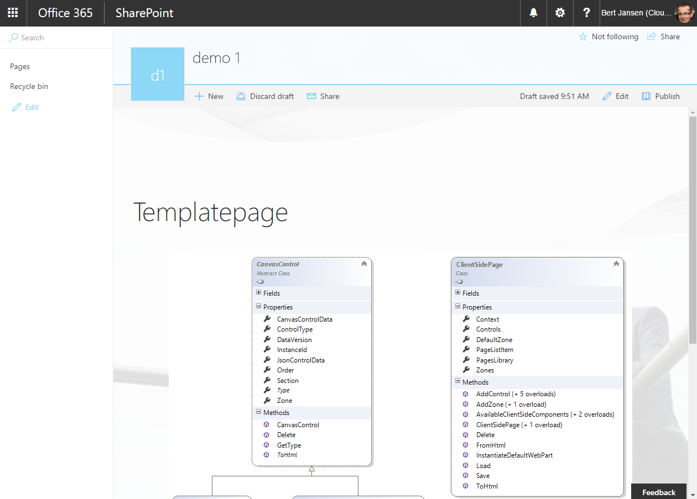

# Programmatically creating and updating "modern" pages #

### Summary ###
This simple console applications shows how you programmatically can create and update modern pages using the supporting extension methods and classes which we add in the March 2017 release of PnP. The below common operations against modern pages are shown:
- Creating an empty modern page
- Adding a text control and custom client slide web part on an existing modern page
- Adding an OOB client side Image web part on a modern page
- Deleting a modern page
- Removing a control from a modern page

### Applies to ###
-  Office 365 Multi Tenant (MT)

### Solution ###
Solution | Author(s)
---------|----------
Provisioning.ModernPages | Bert Jansen (**Microsoft**)

### Version history ###
Version  | Date | Comments
---------| -----| --------
1.0  | March 15th 2017 | Initial release

### Disclaimer ###
**THIS CODE IS PROVIDED *AS IS* WITHOUT WARRANTY OF ANY KIND, EITHER EXPRESS OR IMPLIED, INCLUDING ANY IMPLIED WARRANTIES OF FITNESS FOR A PARTICULAR PURPOSE, MERCHANTABILITY, OR NON-INFRINGEMENT.**

----------

# Introduction
Modern pages are the default page type for both modern SharePoint sites as for classic SharePoint team sites, hence being able to use CSOM to create modern pages and update them by adding or removing client side web parts is something that’s very useful SharePoint extensibility scenarios. If you want to learn more about how modern pages are structured then please checkout our [MSDN guidance](https://msdn.microsoft.com/en-us/pnp_articles/modern-experience-customizations-customize-pages#programming-modern-pages).

